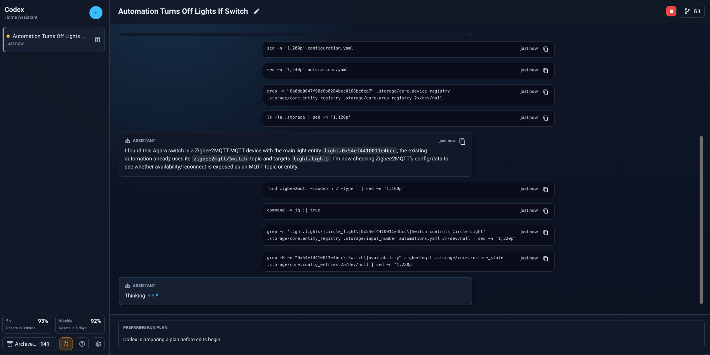
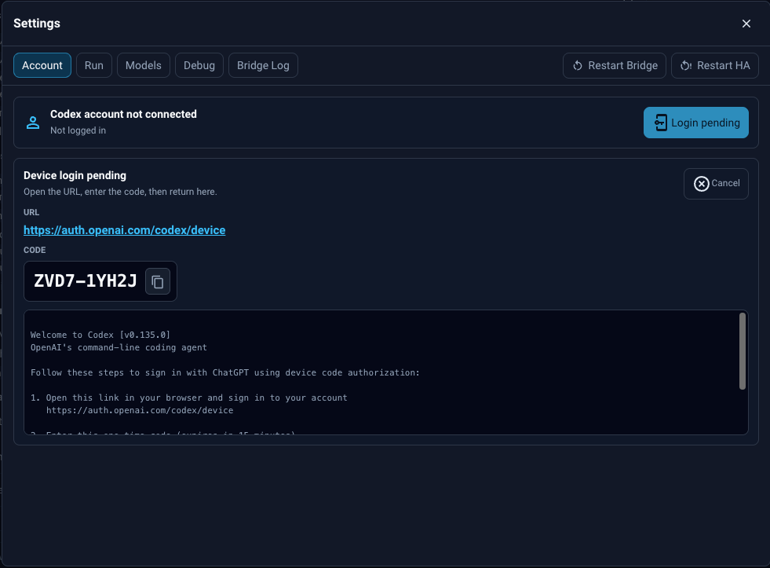
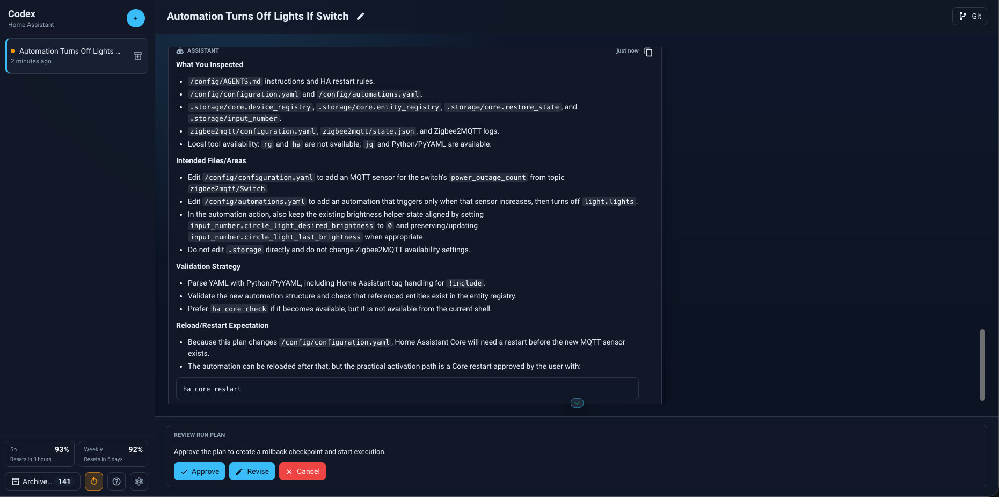

# HA Codex UI

HA Codex UI is a Home Assistant custom integration that adds an admin-only Codex
sidebar panel for inspecting configuration, chatting with Codex, reviewing file
changes, handling approvals, and running Home Assistant validation.

This integration can execute commands and edit files in your Home Assistant
configuration. Keep `require_admin: true`, review approval prompts carefully, and
install it only on Home Assistant instances you control.



## Features

- **Codex inside Home Assistant**: adds an admin-only **Codex** sidebar panel for
  chatting with Codex about your Home Assistant configuration.
- **Home Assistant-aware context**: attach entities, devices, areas,
  automations, scripts, logs, and configuration files so Codex has the right
  context for each request.
- **Safer editing workflow**: review plans, command approvals, file changes, and
  restart requests before changes are applied.
- **Validation and troubleshooting**: run Home Assistant config checks, inspect
  bridge status, view logs, and see Codex runtime diagnostics from the panel.
- **Git-assisted change review**: set up a Git remote, review diffs, commit,
  push, or discard selected files when Git is configured.
- **UI-based setup**: install with HACS, configure from **Settings > Devices &
  services**, and edit options later from **Configure**.

## Prerequisites

Before installing HA Codex UI, make sure you have:

- **Home Assistant access**: use a Home Assistant instance you control and sign
  in with an administrator account. Keep HA Codex UI admin-only.
- **HACS**: install and configure
  [HACS](https://www.hacs.xyz/docs/use/download/download/).
- **Terminal access to Home Assistant**: the installation below uses a shell
  that can access `/config`.
- **Node.js and npm**: the Codex CLI is installed with npm. The installation
  below shows where to check or install them.
- **Codex access**: use an OpenAI or ChatGPT account with Codex access enabled.
- **Optional Git integration requirements**: to use the Git setup page, your
  Home Assistant shell also needs `git`, `ssh-keygen`, network access to your Git
  host, and permission to add the generated SSH public key to the remote account
  or repository.

## Installation

Follow these steps in order. The commands and UI values use the default HA Codex
UI paths:

- Codex CLI executable: `/config/bin/codex`
- Optional Node.js executable for bridge runs: `/config/bin/node`
- Codex credentials: `/config/codex_home`
- Workspace path: `/config`
- Bridge URL: `http://127.0.0.1:8765`

### 1. Open a Home Assistant terminal

Home Assistant OS users usually need a terminal before they can install the
Codex CLI. The simplest path is Advanced SSH & Web Terminal:

1. Open Home Assistant.
2. Go to **Settings > Apps** or **Settings > Add-ons**, depending on your Home
   Assistant version.
3. Open the app/add-on store.
4. Search for **Advanced SSH & Web Terminal**.
5. If it is not listed, add the Home Assistant Community Add-ons repository URL:
   `https://github.com/hassio-addons/repository`.
6. Install
   [Advanced SSH & Web Terminal](https://github.com/hassio-addons/app-ssh).
7. Enable **Start on boot**, **Watchdog**, and **Show in sidebar** if those
   options are available.
8. Start the app/add-on.
9. Open its web terminal from the Home Assistant sidebar, or connect over SSH
   using the app/add-on configuration.
10. Work from the Home Assistant config directory:

```sh
cd /config
```

### 2. Check Node.js and npm

The Codex CLI is installed with npm and needs a Node.js runtime when HA Codex UI
runs it. Check the terminal first:

```sh
node --version
npm --version
```

If both commands print versions, continue to the next step.

If either command is missing in Advanced SSH & Web Terminal, install Node.js and
npm in that terminal app/add-on:

1. Open the **Advanced SSH & Web Terminal** app/add-on page.
2. Open **Configuration**.
3. Add these custom Alpine packages if your version exposes a package list:
   `nodejs` and `npm`.
4. Save the configuration.
5. Restart the app/add-on.
6. Open the web terminal again and run:

```sh
node --version
npm --version
```

For non-Home Assistant OS installs, use the official
[Node.js downloads](https://nodejs.org/en/download) or npm's
[Node.js and npm install guide](https://docs.npmjs.com/downloading-and-installing-node-js-and-npm/).

### 3. Install the Codex CLI at `/config/bin/codex`

HA Codex UI does not bundle the Codex CLI or credentials. Install the CLI into
`/config/bin/codex`, which is the default value used by the integration option
`codex_command`.

```sh
mkdir -p /config/bin /config/codex-cli
npm install --global --prefix /config/codex-cli @openai/codex
ln -sf /config/codex-cli/bin/codex /config/bin/codex
/config/bin/codex --version
```

OpenAI's official Codex CLI setup is documented in the
[Codex CLI getting started guide](https://developers.openai.com/codex/cli#cli-setup).

The HA Codex bridge prepends `/config/bin` to `PATH` before running Codex. If the
HA Codex diagnostics later say that `node` cannot be found, place a working
Node.js executable at `/config/bin/node` and verify it:

```sh
/config/bin/node --version
/config/bin/codex --version
```

If you install Codex somewhere else, write down that executable path. You must
set it later in **Settings > Devices & services > HA Codex UI > Configure** as
`codex_command`.

Optional Git integration check:

```sh
git --version
command -v ssh-keygen
```

### 4. Install HA Codex UI with HACS

[](https://my.home-assistant.io/redirect/hacs_repository/?owner=mmihaylov00&repository=ha-codex-ui&category=integration)

Until the repository is included in the default HACS store, add it as a custom
repository:

1. Open HACS.
2. Select **Custom repositories**.
3. Add `https://github.com/mmihaylov00/ha-codex-ui`.
4. Select category **Integration**.
5. Download **HA Codex UI**.
6. Restart Home Assistant Core.

### 5. Add the Home Assistant integration

After Home Assistant restarts:

1. Open **Settings > Devices & services**.
2. Select **Add integration**.
3. Search for **HA Codex UI**.
4. Confirm or set these options:

| Option | Set it to | Where it is used |
| --- | --- | --- |
| `workspace_path` | `/config` | Codex runs from this Home Assistant config directory. |
| `require_admin` | `true` | Keeps the Codex sidebar panel admin-only. |
| `codex_command` | `/config/bin/codex` | Must match the CLI path created in step 3. |
| `bridge_url` | `http://127.0.0.1:8765` | Enables the packaged local bridge. |
| `addon_write_scope` | `all_visible` | Lets Codex see writable add-on folders when present. |
| `validation_command` | `auto` | Lets HA Codex choose `ha core check` when available. |

To edit these values later, open **Settings > Devices & services**, select
**HA Codex UI**, and choose **Configure**.

### 6. Authenticate Codex

HA Codex UI stores bridge credentials under `/config/codex_home`. Authenticate
from the HA Codex UI Account tab:

1. Make sure your OpenAI or ChatGPT account has Codex access.
2. In Home Assistant, open **Codex** from the sidebar.
3. Open **Settings**.
4. Select **Account**.
5. Click **Log in with device code**.
6. Open the displayed `https://auth.openai.com/codex/device` URL on a device
   where you can sign in to OpenAI.
7. Enter the displayed code and approve the login.
8. Return to HA Codex UI and wait for the Account tab to show the connected
   account.



### 7. Verify the first run

1. Open **Codex** in the Home Assistant sidebar.
2. Open **Settings > Debug** and confirm the Codex command, bridge URL, and
   workspace path look correct.
3. Start with a read-only prompt, such as:

```text
Inspect my Home Assistant configuration and summarize what integrations are configured. Do not edit files.
```

4. Review the run plan, command approvals, and file changes before approving any
   edit.



## Configuration

The preferred setup path is the Home Assistant UI. These are the places where
the important values are created or edited:

| Value | Where to set it | Default or path |
| --- | --- | --- |
| HACS repository | **HACS > Custom repositories** | `https://github.com/mmihaylov00/ha-codex-ui`, category **Integration** |
| Codex CLI install path | Home Assistant terminal, installation step 3 | `/config/bin/codex` |
| Node.js executable, if needed | Home Assistant terminal | `/config/bin/node` |
| Integration options | **Settings > Devices & services > HA Codex UI > Configure** | See the table below |
| Codex credentials | **Codex > Settings > Account** | `/config/codex_home` |
| Git remote and SSH key | **Codex > Settings > Git** | Set only if you want Git review, commit, and push controls |

The integration setup form is prefilled with these defaults:

| Option | Default | Purpose |
| --- | --- | --- |
| `workspace_path` | `/config` | Directory where Codex runs. |
| `require_admin` | `true` | Restricts the sidebar panel to Home Assistant administrators. |
| `codex_command` | `/config/bin/codex` | Codex CLI executable or absolute path. |
| `bridge_url` | `http://127.0.0.1:8765` | Local bridge URL. |
| `addon_write_scope` | `all_visible` | Extra add-on paths exposed to Codex when present. |
| `validation_command` | `auto` | Uses `ha core check` or `hass --script check_config` when available. |

To edit these later, open **Settings > Devices & services**, select
**HA Codex UI**, and choose **Configure**.

YAML configuration remains supported for existing installs and is imported into
a Home Assistant config entry when possible:

```yaml
ha_codex:
  workspace_path: /config
  require_admin: true
  codex_command: /config/bin/codex
  bridge_url: http://127.0.0.1:8765
  addon_write_scope: all_visible
  validation_command: auto
```

Restart Home Assistant Core after changing YAML:

```sh
ha core restart
```

The sidebar panel appears as **Codex** for administrators after Home Assistant
loads the configured integration.

## Authentication Details

HA Codex UI runs Codex through the bridge with:

```sh
CODEX_HOME=/config/codex_home
```

That means Codex credentials must be created under `/config/codex_home`, not the
default home directory for your shell user. Use the installation step
**6. Authenticate Codex** unless you need to troubleshoot login manually.

For Business, Enterprise, or Edu workspaces, a workspace owner/admin may need to
enable Codex access for your user or role. OpenAI's
[Codex plan documentation](https://help.openai.com/en/articles/11369540)
describes Codex Local as the control for CLI, IDE extension, and local app
workflows.

You can also authenticate manually from a shell that can run the same Codex
binary:

```sh
CODEX_HOME=/config/codex_home /config/bin/codex login --device-auth
CODEX_HOME=/config/codex_home /config/bin/codex login status
```

Do not run a plain `codex login` without `CODEX_HOME=/config/codex_home`; that
would create credentials in the terminal user's home directory instead of the
bridge credential directory used by HA Codex UI.

## Bridge Mode

`bridge_url: http://127.0.0.1:8765` enables the packaged local bridge. The bridge
runs Codex outside Home Assistant Core so Codex inherits a safer process
environment and can stream approvals back to the panel.

When the integration starts and `bridge_url` is configured, it starts the bridge
from:

```text
/config/custom_components/ha_codex/bridge/ha_codex_bridge.py
```

Legacy helper scripts under `/config/bin` or `/homeassistant/bin` remain
supported as a fallback for existing local installs.

## Troubleshooting

Enable debug logging:

```yaml
logger:
  default: warning
  logs:
    custom_components.ha_codex: debug
```

Useful checks:

```sh
ha core check
pgrep -af ha_codex_bridge.py
tail -f /config/ha_codex_bridge.log
```

If the panel changes do not appear after an update, refresh the browser and then
restart Home Assistant Core.

## Development

```sh
python3 -m unittest tests.test_ha_codex_core
node --test tests/frontend/*.test.mjs
npm ci --prefix frontend
npm run build --prefix frontend
```

The frontend build writes the production module to:

```text
custom_components/ha_codex/frontend/panel.js
```

## License

Apache-2.0
